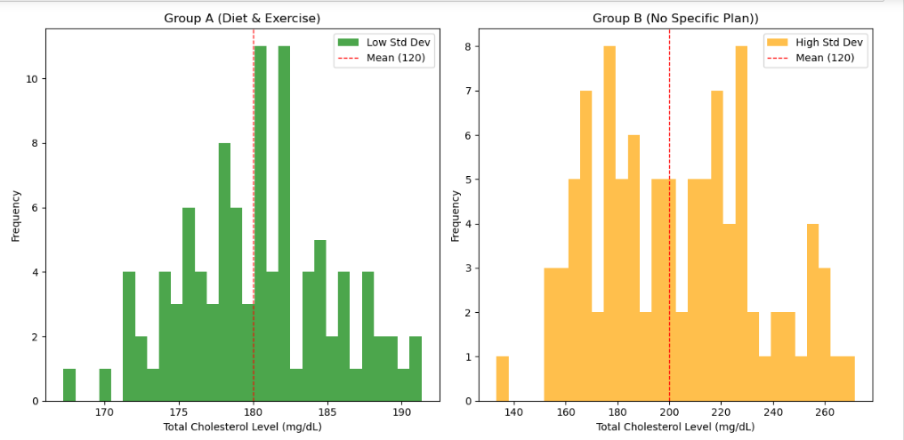

# Analysis of Total Cholestrol Level
The program analyzes spread of Total-Cholestrol-Level readings from mean value. A greater deviation from mean values greater risk of heart attack which is seen for the group of patients leading a unhealthy and unregulated life.

## Table of Contents

- [Description](#description)
- [Technologies Used](#technologies-used)
- [Dataset](#dataset)
- [Program Codes ](#program-codes)
- [Output](#output)
- [Interpretation](#interpretation)

---

## Description

The program analyzes spread of total chlolestrol level readings from mean value. A greater deviation from mean values greater risk of heart attack which is seen for the group leading unhealthy and unregulated life. Where as the other group who do regular exercises and lead a controlled life have less fluctuations in his cholestrol level.

## Technologies-used

Python programming language, pandas and matplotlib package.

## Dataset

The data set is synthetically generated and used for demonstrating the concept only. The program can be easily modified to show results with real readings taken from the patients.

## Program-codes

The programs are written on jupiter notebook, You may run the program on Google colab by clicking on the colab badge below.

## Output

## Interpretation:

The program generates and plots total cholesterol level readings for two groups of patients, illustrating the concept of standard deviation in layman's terms. Here's what the plot communicates:

**Two Histograms:**
- The left histogram shows cholesterol level readings for a group of patients with low standard deviation.
- The right histogram shows cholesterol level readings for a group of patients with high standard deviation.

### Key Points:
**Mean Cholesterol Level:**
- Group A has an average (mean) cholesterol level of 180 mg/dL.
- Group B has an average (mean) cholesterol level of 200 mg/dL.
- The mean is represented by a dashed red line in each plot.

**Standard Deviation:**
- Low Standard Deviation (Left Plot): The cholesterol readings for this group are tightly clustered around the mean. This indicates that most patients in this group have cholesterol levels close to 180 mg/dL.
- High Standard Deviation (Right Plot): The cholesterol readings for this group are spread out over a wider range. This indicates that cholesterol levels vary significantly among patients in this group, with some having much higher or lower levels than the average.

### Interpretation:
**Consistency of Cholesterol Levels:**
- The left plot (Group A) shows patients with cholesterol levels that are consistently around 180 mg/dL, suggesting more stable and predictable cholesterol levels. This group may represent patients who follow a diet and exercise plan.
- The right plot (Group B) shows patients with cholesterol levels that vary widely around 200 mg/dL, suggesting less stability. - This group may represent patients who do not follow a specific plan for managing their cholesterol.

### In Layman's Terms:
The plots visually explain that even if two groups of patients have different average cholesterol levels, one group (Group A) has readings that are close to their average most of the time (left plot), while the other group (Group B) has readings that vary a lot (right plot). Group A's cholesterol levels are more stable, likely due to following a diet and exercise plan, while Group B's cholesterol levels fluctuate more, possibly due to not following a specific plan.
